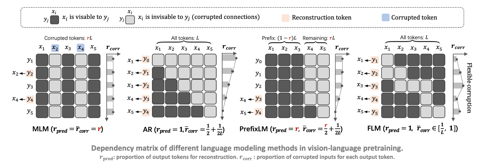

# FLM
Official code for "Accelerating Vision-Language Pretraining with Free Language Modeling" (CVPR 2023) 

Paper: https://arxiv.org/abs/2303.14038


## Introduction



The state of the arts in vision-language pretraining (VLP) achieves exemplary performance but suffers from high training costs resulting from slow convergence and long training time, especially on large-scale web datasets. An essential obstacle to training efficiency lies in the entangled prediction rate (percentage of tokens for reconstruction) and corruption rate (percentage of corrupted tokens) in masked language modeling (MLM), that is, a proper corruption rate is achieved at the cost of a large portion of output tokens being excluded from prediction loss. 

Free language modeling (FLM) is a new language modeling method that enables a 100% prediction rate with arbitrary corruption rates. FLM successfully frees the prediction rate from the tie-up with the corruption rate while allowing the corruption spans to be customized for each token to be predicted. FLM-trained models are encouraged to learn better and faster given the same GPU time by exploiting bidirectional contexts more flexibly. 
<!--  -->
<p align="center">
  
</p>

## Install
```
pip install -r requirements.txt
```
## Dataset Preparation
We follow [ViLT](https://github.com/dandelin/ViLT) and use `pyarrow` to serialize the datasets. See this [link](https://github.com/dandelin/ViLT/blob/master/DATA.md) for details.

## Pretraining
```bash
export MASTER_ADDR=$DIST_0_IP
export MASTER_PORT=$DIST_0_PORT
export NODE_RANK=$DIST_RANK

python run.py with data_root=<DATA_DIR> exp_name="pretrain_FLM_4m" \
    num_gpus=8 resume_from=None fix_exp_version=True  \
    flm text_roberta image_size=288 clip32 causal_flm \
    precision=16 max_steps=30000 learning_rate=0.00008 \
    batch_size=4096 per_gpu_batchsize=64 warmup_steps=0.05
```
#### Pretrained Checkpoints
FLM-CLIP32-RoBERTa (resolution: 288^2) pre-trained on GCC+SBU+COCO+VG [link](https://github.com/TencentARC/FLM/releases/download/checkpoints/pretrain_4m.ckpt)

FLM-CLIP32-RoBERTa fintuned on VQAv2 (resolution: 576^2) [link](https://github.com/TencentARC/FLM/releases/download/checkpoints/pretrain_4M_ft_vqa.ckpt)

FLM-CLIP32-RoBERTa fintuned on NLVR2 (resolution: 288^2) [link](https://github.com/TencentARC/FLM/releases/download/checkpoints/pretrain_4m_ft_nlvr2.ckpt)

## Evaluation on Downstream Tasks
#### Visual Question Answering (VQA v2)
```bash
# training: 4 gpu
python run.py with data_root=<DOWNSTREAM_DATA_DIR> exp_name="pretrain_FLM_4m_ft_vqa_train" \
      num_gpus=4 resume_from=None fix_exp_version=True load_path="pretrain_4m.ckpt" \
      ft_vqa text_roberta  image_size=576 clip32 causal_flm \
      learning_rate=0.000005 batch_size=512 per_gpu_batchsize=32 log_dir='result_ft' clip_randaug

# testing: 4 gpu
python run.py with data_root=<DOWNSTREAM_DATA_DIR> exp_name="pretrain_FLM_4m_ft_vqa_test" \
      num_gpus=4 load_path="pretrain_4M_ft_vqa.ckpt" \
      ft_vqa text_roberta  image_size=576 clip32 causal_flm \
      per_gpu_batchsize=32 log_dir='result_ft' test_only=True skip_test_step=True
```

#### Natural Language for Visual Reasoning
```bash
# training: 1 gpu
python run.py with data_root=<DOWNSTREAM_DATA_DIR> exp_name="pretrain_FLM_4m_ft_nlvr2_train" \
      num_gpus=1 resume_from=None fix_exp_version=True load_path="pretrain_4m.ckpt" \
      ft_nlvr2 text_roberta  image_size=288 clip32 causal_flm \
      learning_rate=0.00001 batch_size=256 per_gpu_batchsize=32 log_dir='result_ft' clip_randaug

# testing: 1 gpu
python run.py with data_root=<DOWNSTREAM_DATA_DIR> exp_name="pretrain_FLM_4m_ft_nlvr2_test" \
      num_gpus=1 load_path="pretrain_4M_ft_nlvr2.ckpt" \
      ft_nlvr2 text_roberta  image_size=288 clip32 causal_flm \
      per_gpu_batchsize=32 log_dir='result_ft' test_only=True skip_test_step=True
```

#### Image Captioning
```bash
# training: 4 gpu
python run.py with data_root=<DOWNSTREAM_DATA_DIR> exp_name="pretrain_FLM_4m_ft_cap_coco_train" \
      num_gpus=4 resume_from=None fix_exp_version=True load_path="pretrain_4m.ckpt" \
      ft_cap_coco text_roberta  image_size=288 clip32 causal_flm \
      learning_rate=0.000003 batch_size=256 per_gpu_batchsize=64 log_dir='result_ft' clip_randaug

# testing: 4 gpu
python run.py with data_root=<DOWNSTREAM_DATA_DIR> exp_name="pretrain_FLM_4m_ft_cap_coco_test" \
      num_gpus=4 load_path="pretrain_4M_ft_cap.ckpt" \
      ft_cap_coco text_roberta  image_size=384 clip32 causal_flm \
      per_gpu_batchsize=64 log_dir='result_ft' test_only=True skip_test_step=True
```

#### Image-Text Retrieval

```bash
# training: 8 gpu
python run.py with data_root=<DOWNSTREAM_DATA_DIR> exp_name="pretrain_FLM_4m_ft_irtr_f30k_train" \
      num_gpus=8 resume_from=None fix_exp_version=True load_path="pretrain_4m.ckpt" \
      ft_irtr_f30k text_roberta  image_size=384 clip32 causal_flm precision=16 \
      learning_rate=0.000005 batch_size=512 per_gpu_batchsize=8 log_dir='result_ft' clip_randaug

# testing: 8 gpu
python run.py with data_root=<DOWNSTREAM_DATA_DIR> exp_name="pretrain_FLM_4m_ft_irtr_f30k_test" \
      num_gpus=8 load_path="pretrain_4M_ft_irtr_f30k.ckpt" \
      ft_irtr_f30k text_roberta  image_size=384 clip32 causal_flm \
      per_gpu_batchsize=8 log_dir='result_ft' test_only=True skip_test_step=True
```


## Citation
```
@misc{wang2023accelerating,
      title={Accelerating Vision-Language Pretraining with Free Language Modeling}, 
      author={Teng Wang and Yixiao Ge and Feng Zheng and Ran Cheng and Ying Shan and Xiaohu Qie and Ping Luo},
      year={2023},
      eprint={2303.14038},
      archivePrefix={arXiv},
      primaryClass={cs.CV}
}
```

## Acknowledgements
The code is highly based on [METER](https://github.com/zdou0830/METER) and [ViLT](https://github.com/dandelin/ViLT).